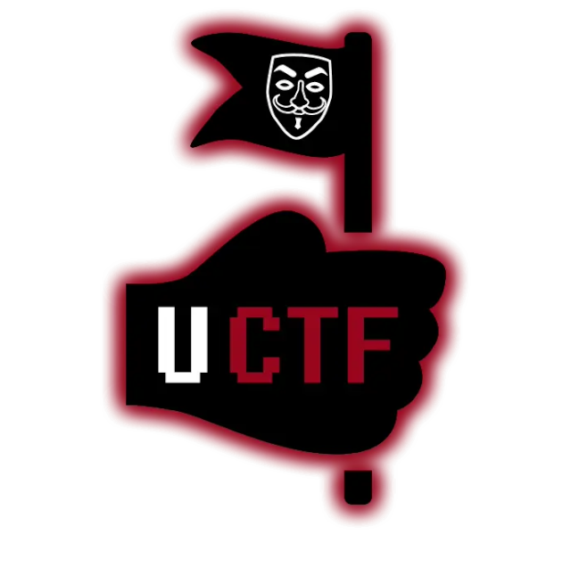
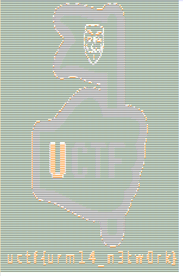

# Network Punk

Some cyberpunk hide the flag inside a network traffic. We have dumped the traffic. Your task is to find the flag to save the city.

# Write Up

The attendant should download and open the dumped traffic using a tool such as [Wireshark](https://www.wireshark.org/download.html). In the dumped file, there is tcp connection between a client app and a server app working on 127.0.0.10. In one of the records, server sends the flag. The attendant should save the flag in a text file since the flag is in ASCII ART format and then, can gain the flag.

# Flag

**uctf{urm14_n3tw0rk}**

or

**uctf{u r m 1 4 _ n 3 t w 0 r k}**

# Categories

This question belongs to Forensics category.

- [ ] Web
- [ ] Reverse
- [ ] PWN
- [ ] Misc
- [x] Forensics
- [ ] Cryptography
- [ ] Steganography

# Points

| Warm up | This Challenge | Evil |
| ------- |:--------------:| ----:|
| 25      | 200-250        | 500  |

# Resources

The dump file is [here](Resources/traffic.pcap).

The main picture is this:

