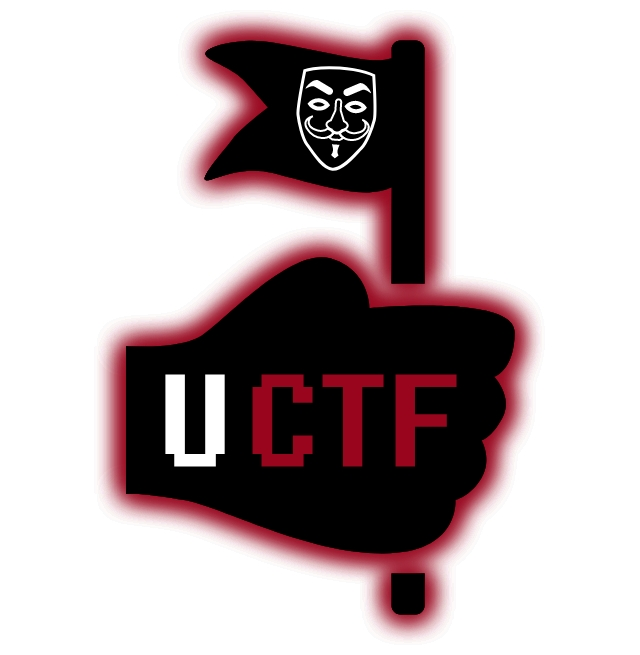

# Project Meme

There are three parts of the flag hide by tacocat. Look precisely to find and gather them all to find the complete flag.

# Write Up

Real name of game is tacocat as the app says there is one flag in app that is divied into 3 parts;

1. First part in hint of a button in "Main Activity" competitor should unzip the app and then find it.
2. Second part is in assets file on app also should unzip the app and find the flag in svg file of the flag.
3. Third part of flag is a function in **c++** that should be run to get flag. There is a ```if(flase)``` competitur should use smali code injection to make that condtion to ```true``` and get the flag.

After finding each part and insert them in app and app will tell them which part of the flag he/she found (first, second, third).

# Flag

uctf_UrmiaDesert

uctf{uctf_UrmiaDesert}

# Categories

Check the categories which the challenge belongs to.

- [ ] Web
- [x] Reverse
- [ ] PWN
- [ ] Misc
- [ ] Forensics
- [ ] Cryptography
- [ ] Steganography

# Points

| Warm up | This Challenge | Evil |
| ------- |:--------------:| ----:|
| 25      | 300-350        | 500  |

# Resources

The [final APK](Resources/TacocaT.apk) file.