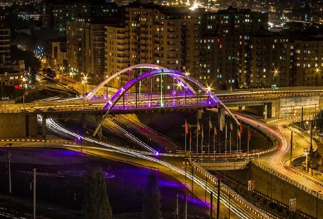

# Warm Up

Welcome to [UrmiaCTF](https://uctf.ir).

CTF is a capture the flag (CTF) contest which is a special kind of cybersecurity competition designed to challenge its participants to solve computer security problems and/or capture and defend computer systems. The competition consists of a series of challenges where participants should your their knowledge, innovation and tools in order to solve the challenges. The challenges are all set up with the intent of being hacked, making it an excellent, legal way to get hands-on experience.

Urmia CTF (UCTF) is a student-led cybersecurity competition organized by [Urmia University](https://urmia.ac.ir) and [Urmia University of Technology](https://uut.ac.ir). This CTF is geared more towards university students, but anyone may compete!

Feel free to solve this warm up question by sending ```UCTF{W3lc0m3_t0_URMIA}``` as the flag. Notice we tried to design the flags related to our city, [Urmia](https://en.wikipedia.org/wiki/Urmia). Hope to see you in Urmia!



# Write Up

It's obvious. The flag is in MarkDown itself.

# Flag

UCTF{W3lc0m3_t0_URMIA}

# Categories

Check the categories which the challenge belongs to.

- [ ] Web
- [ ] Reverse
- [ ] PWN
- [x] Misc
- [ ] Forensics
- [ ] Cryptography
- [ ] Steganography
- [x] Warm Up

# Points

| Warm up | This Challenge | Evil |
| ------- |:--------------:| ----:|
| 25      | 25             | 500  |

# Resources

There is no resource for this question.