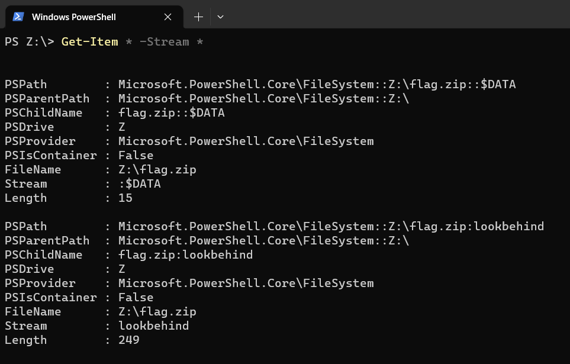
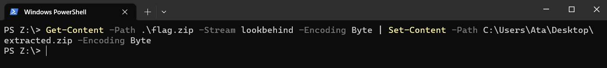

# Hidden Streams

Explore the available streams and consider the different types of data that can be associated with a single filename. Good luck!

# Write Up

In this write-up, we will explore how to use Microsoft PowerShell to find Alternate Data Streams (ADS) in the NTFS file system. ADS allows for the embedding of hidden data within files without altering their original content. PowerShell provides commands that can help identify and interact with ADS, making it a useful tool for forensic analysis and security assessments.

Here are the steps:

1. Locate Available Alternate Data Streams
To locate the available alternate data streams available for a file, you can use the Get-Item cmdlet with the -Stream parameter.
Below you will see the output from the Get-Item cmdlet. It lists the stream available along with the length of the stream. The flag.txt file contains two data streams: \$DATA and lookbehind.

2. Read Alternate Data Streams
To read an alternate data stream, you can use the Get-Content cmdlet.

# Flag

Flag is uctf{St. Mary Church}

# Categories

Check the categories which the challenge belongs to.

- [ ] Web
- [ ] Reverse
- [ ] PWN
- [ ] Misc
- [ ] Forensics
- [ ] Cryptography
- [X] Steganography

# Points

| Warm up | This Challenge  | Evil |
| ------- |:---------------:| ----:|
| 25      |     250-300     | 500  |

# Resources

This question have a zip file that contains VHD.