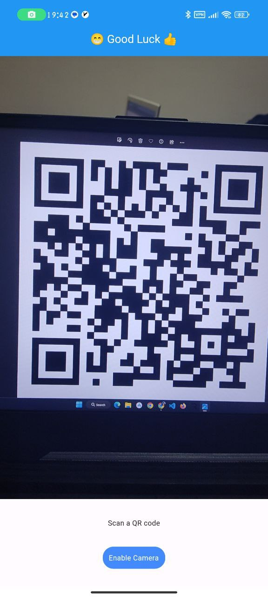

# Flutter QRCode

There is a BOMB in city hall and a code to disarm the BOMB is hidden in this Application. Your goal is to find this code to save city.

# Write Up

To solve the Problem the attendant should install the app on their phone at first.
then they should decompile apk using apktools.

After that they should go to path qrCode\lib\arm64-v8a in terminal and use command strings to get strings in the file named libapp.so so they can query in the strings list. This phase has multiple ways to get the specefic string. for example:

1.

2.

Now they should send one of these two strings as SMS to the device that has application installed.

After this phase they should see their device opens url in Browser. This url contains QR code image that they should open this on another device because they need to scan it.

After Scanning the QR code they should hear voice of voice assistant of OS pronouncing the flag so they should write it down.

# Flag

uctf{Three-Domes-Urmia}

or

uctf{three-domes-urmia}

# Categories

Check the categories which the challenge belongs to.

- [ ] Web
- [x] Reverse
- [ ] PWN
- [ ] Misc
- [x] Forensics
- [ ] Cryptography
- [ ] Steganography

# Points

| Warm up | This Challenge  | Evil |
| ------- |:---------------:| ----:|
| 25      |       450       | 500  |

# Resources

The Application file is [here](Resources/qrCode.apk).