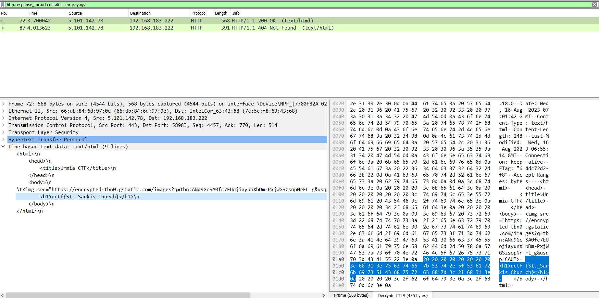

# HTTPS Decryption

In this challenge, you are provided with a file containing captured network packets and a file containing master keys. Your task is to decrypt the HTTPS traffic and find the flag hidden within the decrypted data. The target domain for this challenge is mrgray.xyz. Good luck!

# Write Up

To solve this CTF question, you'll need to decrypt HTTPS traffic using Wireshark and the provided master keys. Here's a hint to guide you through the process:

1. First, open the captured packets file in Wireshark.
2. Go to Edit > Preferences > Protocols > TLS.
3. In the (Pre)-Master-Secret log filename section, add the file containing the provided master keys
4. Apply the changes and close the Preferences window.
5. Analyze the decrypted traffic to find the flag.

# Flag

Flag is uctf{St._Sarkis_Church}

# Categories

Check the categories which the challenge belongs to.

- [ ] Web
- [ ] Reverse
- [ ] PWN
- [ ] Misc
- [X] Forensics
- [ ] Cryptography
- [ ] Steganography

# Points

| Warm up | This Challenge  | Evil |
| ------- |:---------------:| ----:|
| 25      |     250-300     | 500  |

# Resources

Attachments:
1. captured_packets.pcap
2. master_keys.log